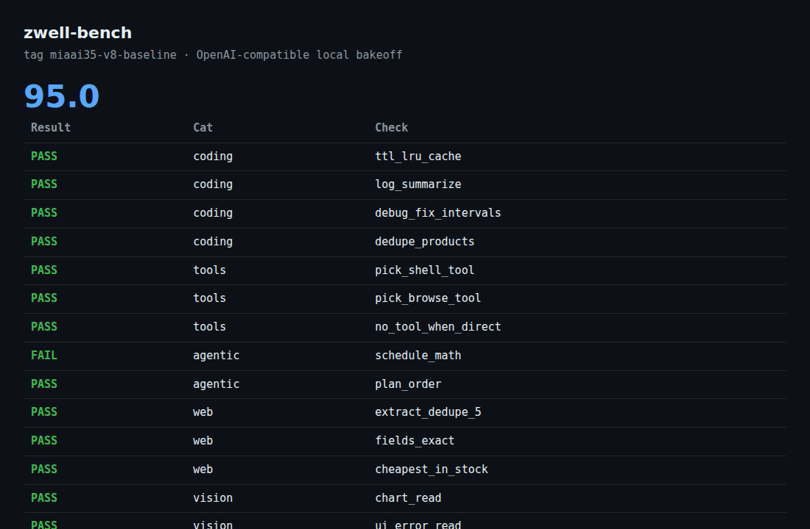

# zwell-bench



Endpoint-agnostic **local LLM bakeoff** harness for DGX Spark (or any box with an OpenAI-compatible API).

Checks are objective: executed coding tests, exact JSON extraction, vision reads, tool choice, agentic ordering.

## At a glance

| | |
|---|---|
| **What it is** | An **endpoint-agnostic local-LLM bakeoff harness** — coding (executed), web extraction, vision, tool-calling, and agentic checks against any OpenAI-compatible API. |
| **What it’s for** | Honest head-to-head comparison of local models/servers with **objective** pass/fail (not vibes or chat screenshots). |
| **How to use it** | `./setup.sh`, then `ZWELL_BASE=http://127.0.0.1:8889 ./.venv/bin/python bench_zwell.py --tag my-model`. Or just open `results/` for example JSON. |

## Try it (pick one)

### One command
```bash
git clone https://github.com/Coinupbtc/zwell-bench.git
cd zwell-bench && ./setup.sh
```

### Copy-paste
```bash
git clone https://github.com/Coinupbtc/zwell-bench.git && cd zwell-bench
python3 -m venv .venv && .venv/bin/pip install -r requirements.txt
ZWELL_BASE=http://127.0.0.1:8889 ./.venv/bin/python bench_zwell.py --tag my-model
```

### Just browse results
Open `results/` — example JSON from a dual-Spark bakeoff (hosts scrubbed to placeholders).

## Env knobs

| Env | Default | Meaning |
|-----|---------|---------|
| `ZWELL_BASE` | `http://127.0.0.1:8889` | Chat completions base URL |
| `ZWELL_MODEL` | `m` | Model id your server expects |
| `ZWELL_THINKING` | `off` | Set `on` for thinking models |
| `ZWELL_MAXTOK_MULT` | `1` | Raise (e.g. `6`) when thinking expands outputs |

## Layout

| Path | What |
|------|------|
| `bench_zwell.py` | Harness |
| `assets/` | Vision fixtures |
| `results/` | Example run JSON |
| `setup.sh` | One-command env setup |


## License

MIT
