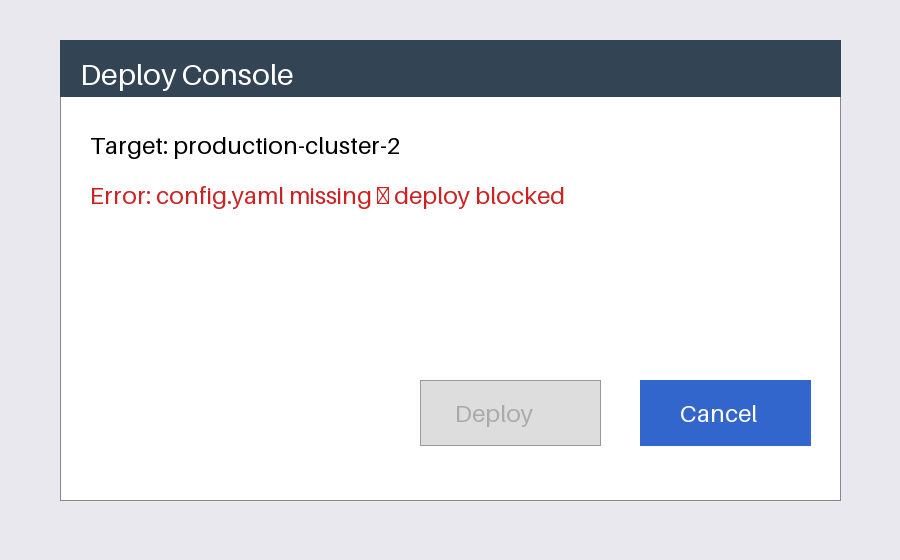

# zwell-bench



Endpoint-agnostic **local LLM bakeoff** harness for DGX Spark (or any box with an OpenAI-compatible API).

`bench_zwell.py` defines **15** objective checks (not 19): executed coding tests, exact JSON extraction, vision reads, tool choice, agentic ordering. The headline number is **category-weighted** (coding 35%, web 20%, vision 20%, tools 15%, agentic 10%), so 14/15 can be 95.0 — it is not raw n/n and it is not 19/19.

The screenshot is the committed `results/miaai35-v8-baseline.json` run: **14/15**, weighted **95.0/100**, failed `agentic/schedule_math`. That is not a perfect score. All four files in `results/` are the bakeoff as run; none is a full pass, and none was cherry-picked.

## Committed results (15-check harness)

| Tag | Checks | Weighted | Failed checks (as committed) |
|-----|--------|----------|------------------------------|
| `miaai35-v8-baseline` | 14/15 | 95.0 | `schedule_math` |
| `miaai35-v8-thinking` | 13/15 | 82.5 | `ttl_lru_cache`, `dedupe_products` |
| `mimo-v25-iq2m-thinking` | 13/15 | 82.5 | `ttl_lru_cache`, `log_summarize` |
| `mimo-v25-iq2m-baseline` | 12/15 | 81.2 | `dedupe_products`, `no_tool_when_direct`, `schedule_math` |

Checks in `bench_zwell.py`: coding (`ttl_lru_cache`, `log_summarize`, `debug_fix_intervals`, `dedupe_products`); tools (`pick_shell_tool`, `pick_browse_tool`, `no_tool_when_direct`); agentic (`schedule_math`, `plan_order`); web (`extract_dedupe_5`, `fields_exact`, `cheapest_in_stock`); vision (`chart_read`, `ui_error_read`, `ui_disabled_btn`). `bench_coinupbtc.py` is a separate 11-check personal eval and is **not** part of these scores.

## At a glance

| | |
|---|---|
| **What it is** | An **endpoint-agnostic local-LLM bakeoff harness** — 15 objective checks (coding executed, web extraction, vision, tool-calling, agentic) against any OpenAI-compatible API. |
| **What it’s for** | Honest head-to-head comparison of local models/servers with **objective** pass/fail (not vibes or chat screenshots). |
| **How to use it** | `./setup.sh`, then `ZWELL_BASE=http://127.0.0.1:8889 ./.venv/bin/python bench_zwell.py --tag my-model`. Or just open `results/` for example JSON. |

## Try it (pick one)

### One command
```bash
git clone https://github.com/Coinupbtc/zwell-bench.git
cd zwell-bench && ./setup.sh
```

### Copy-paste
```bash
git clone https://github.com/Coinupbtc/zwell-bench.git && cd zwell-bench
python3 -m venv .venv && .venv/bin/pip install -r requirements.txt
ZWELL_BASE=http://127.0.0.1:8889 ./.venv/bin/python bench_zwell.py --tag my-model
```

### Just browse results
Open `results/` — the four committed JSON runs above (hosts scrubbed to placeholders). None is 15/15.

## Env knobs

| Env | Default | Meaning |
|-----|---------|---------|
| `ZWELL_BASE` | `http://127.0.0.1:8889` | Chat completions base URL |
| `ZWELL_MODEL` | `m` | Model id your server expects |
| `ZWELL_THINKING` | `off` | Set `on` for thinking models |
| `ZWELL_MAXTOK_MULT` | `1` | Raise (e.g. `6`) when thinking expands outputs |

## Layout

| Path | What |
|------|------|
| `bench_zwell.py` | Harness (15 checks, category-weighted score) |
| `assets/` | Vision fixtures |
| `results/` | Committed bakeoff JSON (none is 15/15) |
| `setup.sh` | One-command env setup |


## License

MIT
